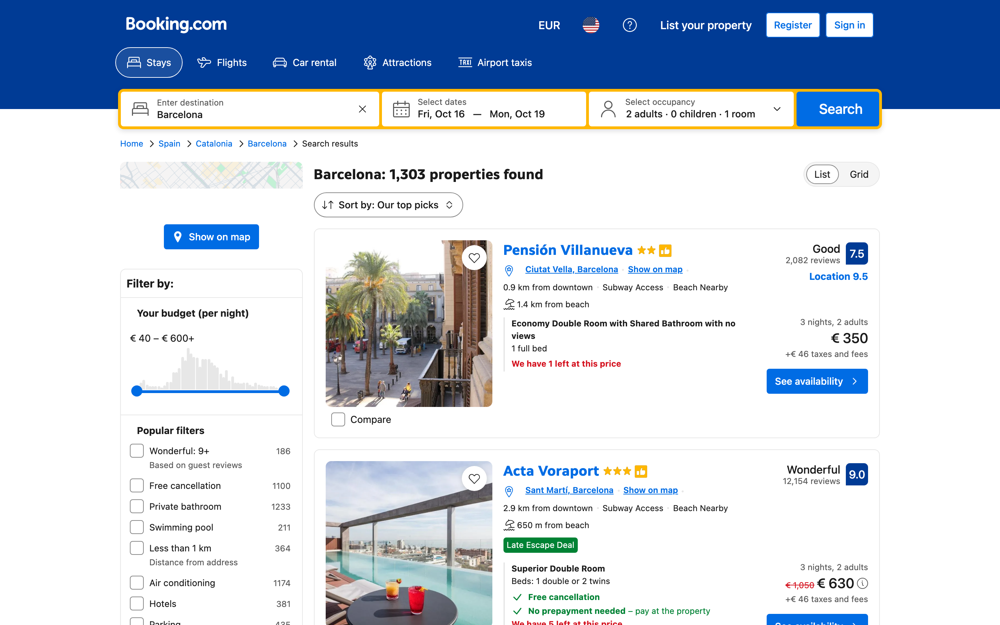
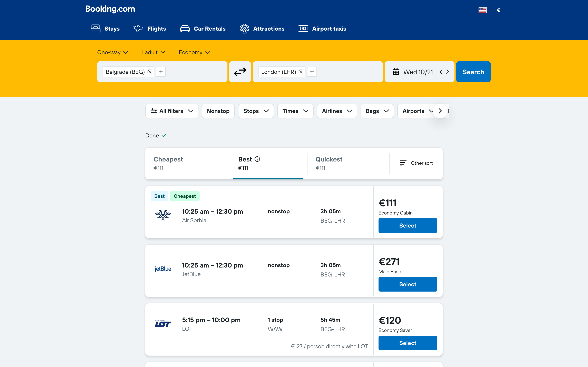
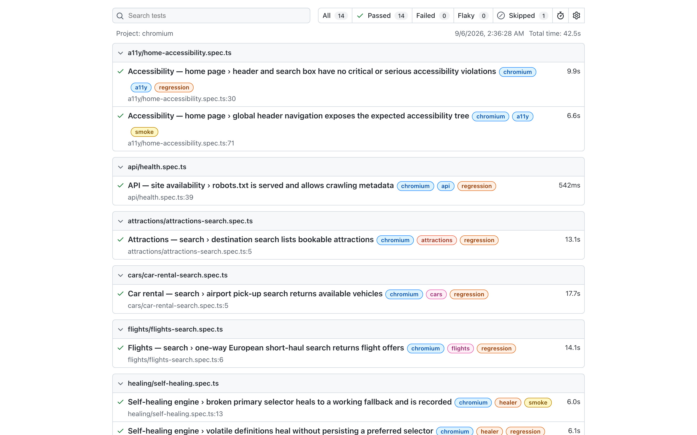

# Self-Healing Playwright Framework

[](https://github.com/IvanPetrovic991/self-healing-playwright-framework/actions/workflows/playwright.yml)

A portfolio E2E automation framework — **Playwright 1.63 + TypeScript + Page Object Model + self-healing locators** — demonstrated end to end against **booking.com** as the example target. It covers all four major products of that site (**Stays, Flights, Car rentals, Attractions**) plus accessibility and API-level checks.

> **About this project.** This is an independent, personal showcase of my test-automation work, published for demonstration purposes only. It is **not affiliated with, endorsed by, or sponsored by Booking.com** (a trademark of Booking.com B.V.). The site was picked as the demo target precisely because it is one of the hardest public sites to automate reliably: aggressive anti-bot protection, constant A/B DOM experiments, white-label sub-products with entirely different markup, and slow asynchronous searches. Each run performs a handful of read-only public searches — no accounts, no bookings, nothing stored beyond the test report — never attempts to bypass a bot challenge (a challenge skips the test), and is not meant for monitoring or price gathering. Run it sparingly against the public site, or point `BASE_URL` at an environment you control. The screenshots show the public website; the names, logos, property photos and map imagery in them belong to their respective owners and are reproduced solely to document what the framework drives.

|                |                                                                                           |
| -------------- | ----------------------------------------------------------------------------------------- |
| Test runner    | [@playwright/test](https://playwright.dev) 1.63                                           |
| Language       | TypeScript 5.9 (strict mode, `noUncheckedIndexedAccess`)                                  |
| Design pattern | Page Object Model + component objects + builder pattern for test data                     |
| Resilience     | Self-healing locator engine with persistent healing store                                 |
| Browsers       | Chromium, Firefox, WebKit (Playwright projects)                                           |
| Quality gates  | ESLint 9 (type-aware promise safety + eslint-plugin-playwright), Prettier, `tsc --noEmit` |
| CI             | GitHub Actions — sharded matrix, merged blob reports, nightly full regression cron        |
| Verified       | Full suite (15 tests) passing against live booking.com; bot challenges auto-skip          |

## Showcase

What the suite drives and what it reports — captured by the framework itself (`npm run docs:screenshots`):

|                  Stays home — main search box                   |     Stays results — live search driven by the framework      |
| :-------------------------------------------------------------: | :----------------------------------------------------------: |
|              |   |
| **Flights results — Kayak white-label variant, auto-detected**  | **Playwright HTML report — full suite green, tag-annotated** |
|  |   |

## Table of contents

- [Showcase](#showcase)
- [Prerequisites](#prerequisites)
- [Installation & setup](#installation--setup)
- [Configuration](#configuration)
- [Project structure](#project-structure)
- [Architecture](#architecture)
- [Self-healing locators](#self-healing-locators)
- [Test suites](#test-suites)
- [Running tests](#running-tests)
- [Reports & artifacts](#reports--artifacts)
- [Modern Playwright features in use](#modern-playwright-features-in-use)
- [Writing a new test](#writing-a-new-test)
- [CI/CD pipeline](#cicd-pipeline)
- [Code quality & conventions](#code-quality--conventions)
- [Live-site quirks & troubleshooting](#live-site-quirks--troubleshooting)
- [Possible extensions](#possible-extensions)
- [License](#license)

## Prerequisites

- **Node.js ≥ 22** (declared via the `engines` field; `.nvmrc` pins Node 24, which CI uses as well)
- **npm** (ships with Node)
- ~1 GB disk for Playwright browser binaries

## Installation & setup

```bash
git clone <repo-url> && cd self-healing-playwright-framework
npm install                        # installs @playwright/test, axe-core, tooling
npx playwright install             # all three browser projects (chromium/firefox/webkit)
cp .env.example .env               # optional — every value has a sensible default

npm run test:smoke                 # quick sanity run (~30 s)
npm test                           # full suite, all configured browsers
```

Chromium-only setup works too — just keep the run scoped to the installed browser:

```bash
npx playwright install chromium
npm run test:chromium              # or any command with --project=chromium
```

No further setup is required: there is no login flow, no seed data, and no external services. The suite runs against the public booking.com site (see [Live-site quirks](#live-site-quirks--troubleshooting)).

## Configuration

All runtime knobs come from `.env`, loaded, validated and typed in [`src/config/env.ts`](src/config/env.ts) — an invalid value falls back to its default instead of silently breaking behavior. A git-ignored `.env.local` (same keys) overrides `.env` for developer-specific values. Environments (local, CI, staging mirror) differ only by their env files — never by code changes.

| Variable               | Default                   | Purpose                                                                              |
| ---------------------- | ------------------------- | ------------------------------------------------------------------------------------ |
| `BASE_URL`             | `https://www.booking.com` | Target environment; all page paths are relative to it                                |
| `HEADLESS`             | `true`                    | Headless vs. headed browser                                                          |
| `DEFAULT_TEST_TIMEOUT` | `150000`                  | Per-test timeout (ms) — generous because flight/car searches are slow on the backend |
| `EXPECT_TIMEOUT`       | `15000`                   | Default `expect()` polling timeout (ms)                                              |
| `HEALER_TIMEOUT`       | `20000`                   | Overall deadline (ms) for the self-healing locator to resolve an element             |
| `HEALER_GRACE_MS`      | `2000`                    | How long the primary keeps exclusive right to match before a fallback may heal       |
| `LOG_LEVEL`            | `info`                    | `debug` / `info` / `warn` / `error` — framework logger verbosity                     |
| `BLOCK_TRACKERS`       | `true`                    | Abort requests to third-party analytics/trackers (faster, more stable runs)          |
| `CI`                   | unset                     | Set by CI; switches reporters, enables 2 retries, `maxFailures`, `globalTimeout`     |

Key `playwright.config.ts` decisions:

- **Projects**: `chromium`, `firefox`, `webkit`. Select with `--project=<name>`. The Chromium project launches with `--disable-blink-features=AutomationControlled`, which keeps the browser from advertising the `navigator.webdriver` automation signal. That is the only fingerprint adjustment the framework makes — no proxy rotation, no CAPTCHA solving — and a bot challenge still skips the test rather than being worked around.
- **Parallelism**: `fullyParallel: true`; CI pins 2 workers per shard.
- **Retries**: 1 locally (live-site flakiness absorber), 2 on CI.
- **Failure forensics**: `trace: 'retain-on-failure'`, `screenshot: 'only-on-failure'`, `video: 'retain-on-failure'`.
- **Reporters**: local → `list` + `html` + `json` + custom HealingReporter; CI → `list` + `github` (PR annotations) + `blob` (for cross-shard merging) + HealingReporter.
- **CI guard rails**: `maxFailures: 10` and `globalTimeout: 45 min` stop hopeless runs early.
- `testIdAttribute: 'data-testid'` — booking.com's primary test hook attribute, used by `getByTestId` and most primary selectors.

## Project structure

```
├── playwright.config.ts          # projects, reporters, timeouts, artifacts
├── playwright.docs.config.ts     # separate config for README screenshot capture
├── .github/workflows/playwright.yml  # CI: static checks → sharded tests → merged report
├── .env.example                  # documented configuration template
├── .nvmrc                        # Node version for developers and CI
├── .healing/healing-store.json   # git-tracked healed-selector store (see Self-healing locators)
├── src/
│   ├── config/
│   │   └── env.ts                # typed runtime configuration from .env
│   ├── core/
│   │   ├── BasePage.ts           # base class for all page objects
│   │   ├── healing/              # ⭐ self-healing engine
│   │   │   ├── types.ts          #    ElementDefinition, HealingEvent, store shape
│   │   │   ├── SelfHealingLocator.ts  # candidate resolution + healing algorithm
│   │   │   ├── HealingStore.ts   #    persistence, worker-safe event files
│   │   │   └── HealingReporter.ts # custom Playwright reporter — run summary
│   │   └── utils/
│   │       ├── logger.ts         # leveled, timestamped console logger
│   │       ├── dates.ts          # ISO date helpers (calendar cells use data-date)
│   │       └── retry.ts          # generic async retry with back-off
│   ├── fixtures/
│   │   └── test.ts               # custom test object: pages + auto fixtures
│   ├── pages/
│   │   ├── components/           # shared UI: CookieBanner, SignInPopup, HeaderNav
│   │   ├── stays/                # StaysHomePage, StaysResultsPage, PropertyPage
│   │   ├── flights/              # FlightsHomePage (native + Kayak), FlightsResultsPage
│   │   ├── cars/                 # CarRentalHomePage, CarRentalResultsPage
│   │   └── attractions/          # AttractionsHomePage, AttractionsResultsPage
│   └── data/
│       ├── types.ts              # query/route interfaces
│       ├── testData.ts           # named test data (destinations, routes, pickups)
│       └── builders/
│           └── StaysQueryBuilder.ts  # builder with valid near-future defaults
├── scripts/
│   └── capture-readme-screenshots.spec.ts  # docs tooling, driven by the framework itself
├── docs/screenshots/             # committed images embedded in this README
└── tests/
    ├── smoke/                    # @smoke — shell loads, header tabs present
    ├── stays/                    # @stays — search, property details, filters, sort
    ├── flights/                  # @flights — one-way search end-to-end
    ├── cars/                     # @cars — airport pick-up search
    ├── attractions/              # @attractions — destination search
    ├── a11y/                     # @a11y — axe-core scan + aria snapshot
    ├── api/                      # @api — APIRequestContext availability canaries
    └── healing/                  # @healer — E2E verification of the healing engine
```

## Architecture

The framework is layered; each layer only talks to the one below it:

```
tests/*.spec.ts          intent only: arrange data, call page methods, assert
   ↓ imports { test, expect }
src/fixtures/test.ts     wires page objects + auto fixtures into every test
   ↓ constructs
src/pages/**             page objects & components: locators + user actions
   ↓ resolves elements through
src/core/healing/**      self-healing locator engine + persistence
   ↓ drives
Playwright Page / APIRequestContext
```

### BasePage (`src/core/BasePage.ts`)

Every page object extends `BasePage`, which provides:

- `open()` — navigates to the page's `path` (relative to `BASE_URL`) and dismisses overlays.
- `el(definition)` / `all(definition)` — resolve a single element / a collection through the self-healing engine.
- `dismissOverlays()` — accepts the OneTrust cookie banner (once) and registers an **auto-dismiss locator handler** for the "sign in, save money" popup, which booking shows at unpredictable moments. After registration, Playwright dismisses the popup automatically whenever it would block any action — no polling in test code.
- `safeClick()` — tolerant click for optional elements.

Each page declares its elements as a static map of `ElementDefinition`s (see below) and exposes **user-intent methods** (`searchStays(query)`, `searchOneWay(route, date)`, `applyStarFilter(stars)`) wrapped in `test.step` for readable reports. Page methods return the next page object, so specs chain naturally.

### Components (`src/pages/components/`)

Cross-product UI shared by multiple pages: `CookieBanner`, `SignInPopup` (locator-handler based), `HeaderNav` (the Stays/Flights/Car rental/Attractions tabs). Components receive the `Page` and optionally a shared healer instance.

### Fixtures (`src/fixtures/test.ts`)

Specs import `{ test, expect }` from here instead of `@playwright/test`. The one exception is the API-only spec, which imports the base `test` directly: the auto fixtures below are bound to `page`/`context`, and pulling them in would launch a browser for tests that never need one. Available fixtures:

| Fixture                                                                                            | Type         | Purpose                                                                              |
| -------------------------------------------------------------------------------------------------- | ------------ | ------------------------------------------------------------------------------------ |
| `staysHomePage`, `staysResultsPage`, `flightsHomePage`, `carRentalHomePage`, `attractionsHomePage` | page objects | Pre-wired with a shared healer; zero construction boilerplate in specs               |
| `headerNav`                                                                                        | component    | Global header tab checks/navigation                                                  |
| `healer`                                                                                           | engine       | Direct access to `SelfHealingLocator` (used by healing tests)                        |
| `healingStoreInstance`                                                                             | engine       | Direct access to the worker's healing store                                          |
| `blockTrackers`                                                                                    | **auto**     | Aborts requests to analytics/tracker hosts when `BLOCK_TRACKERS=true`                |
| `consoleErrorTracker`                                                                              | **auto**     | Collects `console.error` + uncaught page errors and attaches them to the test report |

Adding a new page object to the framework = one fixture line here.

### Data layer (`src/data/`)

- `testData.ts` — named, intent-revealing entities (`FLIGHT_ROUTES.europeanShortHaul`, `CAR_RENTAL_QUERIES.belgradeAirport`). A data change is a one-line edit.
- `StaysQueryBuilder` — fluent builder producing valid near-future searches by default; tests override only what they assert on:

```ts
const query = new StaysQueryBuilder()
  .withDestination(DESTINATIONS.mediterranean)
  .withCheckInOffset(40)
  .withNights(3)
  .build(); // → { destination, checkIn: 'YYYY-MM-DD', checkOut, adults: 2, children: 0, rooms: 1 }
```

Dates are always generated relative to "now", so the suite never rots from hardcoded dates.

## Self-healing locators

The core resilience mechanism. Every element in a page object is an `ElementDefinition`:

```ts
destinationInput: {
  key: 'stays.searchbox.destinationInput',      // stable logical identity
  description: 'Destination ("Where are you going?") input',
  candidates: [
    'input[name="ss"]',                            // primary
    '[data-testid="destination-container"] input', // fallback 1
    'input[placeholder*="Where are you going"]',   // fallback 2
  ],
}
```

| Field         | Meaning                                                                                                                              |
| ------------- | ------------------------------------------------------------------------------------------------------------------------------------ |
| `key`         | Unique, human-readable identity (`product.area.element`). Healing is tracked per key                                                 |
| `candidates`  | Ordered selectors — first is the **primary**, the rest are fallbacks                                                                 |
| `description` | Used in logs, healing reports and error messages                                                                                     |
| `volatile`    | Set for selectors with runtime data baked in (e.g. a calendar date): they heal within a run but are **never persisted** as preferred |

### Resolution algorithm (`SelfHealingLocator`)

Each polling pass (250 ms interval, until `HEALER_TIMEOUT` expires):

1. **The primary always gets the first shot.** If it matches while a healed selector is persisted, the primary has **recovered**: the persisted entry is dropped automatically and a `recovered` event is recorded — a fixed primary reclaims its definition without any manual cleanup.
2. **The previously-healed preferred selector** (from `.healing/healing-store.json`) is tried next. No new event — the heal is already known; the reporter lists all active overrides after every run.
3. **The remaining fallbacks** are tried in order, but a fallback win is only accepted after the **grace period** (`HEALER_GRACE_MS`) has elapsed _and_ the primary fails one final re-check. A primary that simply renders late can therefore never be "healed" away by a single instant-check miss.
4. If nothing matches by the deadline → a rich error listing every tried selector and the page URL, with a hint to add a fallback candidate.

Guard rails on what gets persisted:

- A heal that is **ambiguous** for a single-element lookup (the fallback matches several elements) is reported but _not_ persisted — the candidate needs refining, not promoting.
- A persisted selector that no longer appears among the definition's candidates (the team edited the page object) is treated as stale and dropped.
- Matching counts **all** elements, not just the first, so a candidate whose first DOM match is hidden still qualifies when a later match is visible.

### Persistence & parallel safety

Playwright runs tests in parallel worker processes. Each worker appends healing events to its own file under `.healing/events/`; after the run, the **HealingReporter** (single runner process) consolidates them into `.healing/healing-store.json`:

```json
{
  "preferred": {
    "flights.results.flightCards": "[aria-label^=\"Result item\"]"
  },
  "events": [
    {
      "kind": "healed",
      "key": "flights.results.flightCards",
      "failedSelectors": ["[data-testid=\"searchresults_card\"]"],
      "healedSelector": "[aria-label^=\"Result item\"]",
      "persistPreferred": true,
      "url": "https://booking.kayak.com/flights/BEG-LHR/2026-07-25",
      "timestamp": "2026-06-10T10:09:51.455Z"
    }
  ],
  "updatedAt": "2026-06-10T10:10:02.118Z"
}
```

Store hygiene, by construction:

- **Sanitized URLs** — query strings/fragments (session ids, tracking payloads) are stripped before an event is written.
- **No self-test pollution** — `demo.*` keys used by the healer's own E2E tests are reported in the run summary but never persisted.
- **No pointless churn** — the store file is rewritten only when its content actually changes; a run with no healing activity leaves the working tree clean.

The store is committed to git, so heals recorded locally survive across machines once committed. **On CI the store is not fed back automatically** — each shard uploads its `healing-store.json` as an artifact (`healing-store-*`) for inspection; persisting a CI heal is a deliberate local commit, never a pipeline side effect.

The committed store deliberately carries the two `flights.results.*` overrides: the primaries target booking's native flights UI, while the author's region is served the Kayak white-label, so the healed Kayak selectors are the right choice there. A run from a region with the native UI sees the primaries match and drops the overrides automatically — the store showing "green via fallback" for a regional variant is the mechanism working as designed, not unfinished maintenance.

### Maintenance workflow

A heal keeps the suite green, but it also means a primary selector is broken. After **every** run the HealingReporter prints the active preferred overrides — not just this run's events — so "green via fallback" is never invisible. Then:

1. `npm run healing:show` — inspect what healed and to which selector.
2. Promote the healed selector to primary (or fix the primary) in the page object.
3. Re-run: the engine detects the recovered primary and drops the override automatically (`✅ recovered`). `npm run healing:reset` remains available for a clean slate.

The engine is itself covered by E2E tests (`tests/healing/self-healing.spec.ts`), each proving a **live** heal recorded in that very run (never pre-seeded state): a deliberately broken primary must heal to its fallback and be recorded; a volatile definition must heal without persisting; a recovered primary must drop its persisted fallback.

## Test suites

| Spec                                     | Tags                         | What it verifies                                                                                                                                                                                                                                                                                                                                                                                                                                                                                                                                                                                                                    |
| ---------------------------------------- | ---------------------------- | ----------------------------------------------------------------------------------------------------------------------------------------------------------------------------------------------------------------------------------------------------------------------------------------------------------------------------------------------------------------------------------------------------------------------------------------------------------------------------------------------------------------------------------------------------------------------------------------------------------------------------------- |
| `smoke/home.spec.ts`                     | `@smoke`                     | Home page loads with the stays search box; all four product tabs are visible (soft assertions)                                                                                                                                                                                                                                                                                                                                                                                                                                                                                                                                      |
| `stays/stays-search.spec.ts`             | `@stays @regression`         | Full UI search (destination autocomplete → calendar → occupancy steppers → submit) returns relevant results; opening a result card lands on a property page with a name (new-tab handling)                                                                                                                                                                                                                                                                                                                                                                                                                                          |
| `stays/stays-filters.spec.ts`            | `@stays @regression`         | Deep-linked results filtered by star rating — the site's own property total in the header must drop — and sorted by price — the site must report the price sort as active and the cheapest results must move to the top (booking's order is only approximately ascending by displayed amount, so a strict order check would fail on the site's own behavior)                                                                                                                                                                                                                                                                        |
| `flights/flights-search.spec.ts`         | `@flights @regression`       | One-way BEG→LHR search returns priced offers **for the requested route and date**, asserted on the rendered first offer and the displayed date (never on a URL the framework built itself)                                                                                                                                                                                                                                                                                                                                                                                                                                          |
| `cars/car-rental-search.spec.ts`         | `@cars @regression`          | Airport pick-up search returns available vehicles **for the requested location** (URL) with a real inventory count in the heading                                                                                                                                                                                                                                                                                                                                                                                                                                                                                                   |
| `attractions/attractions-search.spec.ts` | `@attractions @regression`   | Destination search lists bookable attractions and the listing header names the destination                                                                                                                                                                                                                                                                                                                                                                                                                                                                                                                                          |
| `a11y/home-accessibility.spec.ts`        | `@a11y @smoke/@regression`   | axe-core WCAG 2.0 A/AA scan — the gate (critical **and serious** violations) covers the header and the search box, i.e. the UI the suite operates, and each region is checked to be present so the gate can never pass vacuously; the full-page scan runs too, attached to the report and summarized as a test annotation, because the site's rotating promotional blocks carry their own defects and gating on them would fail the suite on the site's marketing calendar. Third-party tags are blocked by default (`BLOCK_TRACKERS=false` audits the page exactly as visitors get it). Header navigation matches an aria snapshot |
| `api/health.spec.ts`                     | `@api @smoke/@regression`    | HTTP-level canaries via `request` fixture (no browser): home responds < 400 with real product markup (bot challenges are detected and skip), robots.txt is served                                                                                                                                                                                                                                                                                                                                                                                                                                                                   |
| `healing/self-healing.spec.ts`           | `@healer @smoke/@regression` | The healing engine itself, end to end against the live page: heal, volatile heal, primary recovery — each proven live in the current run                                                                                                                                                                                                                                                                                                                                                                                                                                                                                            |

Search flows use **deep links where the UI adds no coverage value** (e.g. filter tests enter via `searchresults.html?ss=…` URL parameters) — this keeps each test focused on one behavior and immune to unrelated search-box flakiness.

## Running tests

```bash
# by tag
npm run test:smoke | test:regression | test:stays | test:flights | test:cars \
  | test:attractions | test:a11y | test:api | test:healer

# by browser / location
npm run test:chromium
npx playwright test --project=firefox tests/stays
npx playwright test --grep "@stays" --grep-invert "@regression"

# development loop
npm run test:headed      # watch the browser
npm run test:ui          # Playwright UI mode (time travel, watch mode)
npm run test:debug       # inspector, step through
npm run test:failed      # re-run only what failed last time (--last-failed)

# static checks
npm run typecheck && npm run lint && npm run format:check

# docs
npm run docs:screenshots # regenerate README screenshots via the framework
```

Tags compose: a test can carry several (`@stays @regression`), and `--grep` accepts regexes for any boolean combination.

## Reports & artifacts

| Artifact                      | Location                                                                       | When                                                                            |
| ----------------------------- | ------------------------------------------------------------------------------ | ------------------------------------------------------------------------------- |
| HTML report                   | `reports/html` (`npm run report`)                                              | every local run                                                                 |
| JSON results                  | `reports/results.json`                                                         | every local run (machine-readable, for dashboards)                              |
| Traces / screenshots / videos | `reports/test-artifacts/`                                                      | on failure (a trace is recorded on every attempt and kept only for failed ones) |
| Browser console errors        | attachment `browser-console-errors` on the test                                | when any occurred                                                               |
| axe-core full-page report     | attachment `axe-full-page-report` on the a11y test (plus a summary annotation) | always                                                                          |
| Healing summary               | console + `.healing/healing-store.json`                                        | every run                                                                       |
| Blob reports                  | `reports/blob` → merged HTML on CI                                             | CI only (`npm run report:merge` merges them locally too)                        |

Open a failed test's trace with:

```bash
npx playwright show-trace reports/test-artifacts/<test-dir>/trace.zip
```

## Modern Playwright features in use

- **`page.addLocatorHandler`** — the sign-in popup is dismissed automatically whenever it would block an action (`SignInPopup.registerAutoDismiss`), instead of fragile manual polling.
- **`toMatchAriaSnapshot`** — structural accessibility-tree assertion for the global header (partial template, resilient to extra regional menu items).
- **Tags** (`{ tag: ['@stays'] }`) for product-level filtering, **soft assertions** in smoke checks, **`test.step`** for readable reports.
- **Auto fixtures** — every test transparently gets third-party tracker blocking and console/page-error capture attached to the report.
- **axe-core integration** (`@axe-core/playwright`) — WCAG 2.0 A/AA scan; the gate fails on critical and serious violations in the regions the suite operates (header, search box), while the full-page scan is attached to the report and summarized as a test annotation.
- **API testing layer** — `request` fixture (APIRequestContext) canaries; the place to grow contract tests.
- **Sharded CI with blob reports** — shards run in parallel and `merge-reports` produces a single HTML report; the GitHub reporter annotates PRs; `--last-failed` re-runs locally.

## Writing a new test

1. **Page object** — create `src/pages/<product>/NewPage.ts` extending `BasePage`. Declare elements as `ElementDefinition`s with at least one fallback candidate each; expose intent-level methods wrapped in `test.step`:

```ts
export class NewPage extends BasePage {
  readonly path = '/something/';
  readonly pageName = 'New page';

  private static readonly E = {
    submitButton: {
      key: 'something.form.submit',
      description: 'Form submit button',
      candidates: ['[data-testid="submit"]', 'button[type="submit"]'],
    },
  } satisfies Record<string, ElementDefinition>;

  async submit(): Promise<void> {
    const button = await this.el(NewPage.E.submitButton);
    await button.click();
  }
}
```

2. **Fixture** — register it in `src/fixtures/test.ts` (one line in the interface, one in `test.extend`).

3. **Test data** — add named entities to `src/data/testData.ts`; create a builder if the query has many optional fields.

4. **Spec** — create `tests/<product>/<name>.spec.ts`, import `{ test, expect }` from `src/fixtures/test`, tag it (`@<product>`, plus `@smoke` or `@regression`), and add a matching `test:<product>` script to `package.json` if it is a new product.

Conventions: keys follow `product.area.element`; every definition gets a `description`; selectors with runtime data are `volatile: true`; specs assert outcomes (counts, texts, URLs), never selector internals.

## CI/CD pipeline

`.github/workflows/playwright.yml`, three jobs:

1. **static-checks** — `tsc --noEmit`, ESLint, Prettier check. Fails fast before any browser starts.
2. **test** — sharded matrix (`--shard=1/2`, `2/2`), Node from `.nvmrc`, Chromium with cached browser binaries (keyed on `package-lock.json`). The tag filter is **event-aware**: push/PR runs `@smoke`, the nightly cron runs the full `@regression` suite, and manual `workflow_dispatch` takes any filter — passed to the shell via an env var, never interpolated (untrusted input). Each shard uploads its blob report and healing store as artifacts.
3. **merge-report** — downloads all blob reports, runs `playwright merge-reports --reporter html`, uploads a single browsable HTML report artifact. Runs even when tests fail (that report is the valuable one), but not when they were skipped or canceled.

Hardening: `permissions: contents: read`, and a `concurrency` group cancels superseded PR runs (scheduled runs are never canceled). Bot challenges from the live site turn into **skipped** tests, not failures — see [Live-site quirks](#live-site-quirks--troubleshooting).

Triggers: push/PR to `main`/`master`, nightly cron at 03:00 UTC, and manual dispatch with a tag filter. Scale by extending the shard matrix (`1/4 … 4/4`) — no other change needed.

## Code quality & conventions

- **TypeScript strict** + `noUncheckedIndexedAccess`; `npm run typecheck` is a CI gate covering `src`, `tests`, `scripts` and both Playwright configs. Data maps use `satisfies` (not `Record` annotations) so lookups keep literal keys — a typo'd key is a compile error, with zero non-null assertions in specs.
- **ESLint 9 flat config** (`typescript-eslint`) with **type-aware promise safety** (`no-floating-promises`, `no-misused-promises`, `await-thenable` — a dropped `await` on a locator action or async matcher is a lint error, not a silent pass) plus `eslint-plugin-playwright` on spec files; `npm run lint`.
- **Prettier** (`npm run format` / `format:check`), single quotes, 100-column width.
- **English only** — all code, comments, commit messages and docs are written in English.
- Page objects never assert; specs never touch selectors. Assertions live in specs, selectors in page objects, test data in the data layer.

## Live-site quirks & troubleshooting

Booking.com is a production site with anti-bot protection and constant A/B experiments. Known quirks (all discovered and verified during framework development):

| Quirk                                                                       | Impact                                       | How the framework handles it                                                                                                                                                           |
| --------------------------------------------------------------------------- | -------------------------------------------- | -------------------------------------------------------------------------------------------------------------------------------------------------------------------------------------- |
| Occasional CAPTCHA/challenge page                                           | Random test failure                          | Detected explicitly (URL + DOM markers after every navigation, re-checked when a results wait fails, and in the API canary) → `test.skip`, so a bot block turns runs yellow, never red |
| A/B DOM swaps (e.g. `property-card` ↔ `property-card-container`)            | Selector breaks mid-day                      | Exactly what the healer absorbs; observed variants are kept as fallback candidates                                                                                                     |
| `/flights/` redirects back to the stays home page                           | Direct navigation impossible                 | `FlightsHomePage.open()` enters via the header tab like a real user                                                                                                                    |
| Flights served as **Kayak white-label** (booking.kayak.com) in some regions | Completely different DOM                     | `searchOneWay` detects the variant and uses Kayak's stable deep-link scheme `/flights/{FROM}-{TO}/{YYYY-MM-DD}`                                                                        |
| Attractions autocomplete entries are direct links to the listing            | Search button alone does not navigate        | Suggestion links are clicked; explicit submit kept as fallback                                                                                                                         |
| Sign-in popup appears at unpredictable times                                | Intercepted clicks                           | `page.addLocatorHandler` auto-dismisses it whenever it blocks an action                                                                                                                |
| Slow flight/car searches (20–60 s backend time)                             | Premature timeouts                           | Generous, explicit waits on result pages only                                                                                                                                          |
| Car rental backend answers with its own error page ("something went wrong") | 90 s wait that reads like a selector failure | Detected as soon as it renders → fail fast naming the upstream cause; the test retry re-runs the search                                                                                |

Debugging a failure:

1. Open the HTML report (`npm run report`) — failed steps, screenshots, videos.
2. `npx playwright show-trace <trace.zip>` — full time-travel trace.
3. Check the `error-context.md` next to the artifacts — Playwright's accessibility snapshot of the page at failure time (this is how most quirks above were diagnosed).
4. Check the healing summary — if a key failed entirely, the page got a new DOM variant: inspect, add a candidate.

For anything beyond an occasional demo run, point `BASE_URL` at a test or mirror environment you control. The public site rate-limits datacenter ranges (hosted CI runners included), and the framework deliberately does not work around that: push/PR runs stay on `@smoke`, and a rate-limited or challenged run skips its tests instead of retrying through other network routes.

## Possible extensions

Deliberately not included, with rationale:

- **Visual regression** (`toHaveScreenshot`) — permanently red against a live site with A/B tests and dynamic pricing; valuable once a stable test environment exists.
- **Authenticated flows** (storage-state setup project) — booking.com login requires real credentials and triggers 2FA/CAPTCHA; the project-dependencies structure is ready when a test account exists.
- **Allure reporting / Docker image / pre-commit hooks** — easy additions; current HTML+blob reporting and CI static checks cover the same needs with less moving parts.
- **Negative and edge-case specs** (empty destination, unknown destination, a filter combination with zero results) — the natural next step for assertion discipline; each case needs one headed session first to pin down the site's exact behavior before it is asserted.

## License

[MIT](LICENSE) — the framework code is free to reuse and adapt. Booking.com and every other name, logo and image visible in the screenshots remain the property of their respective owners.
